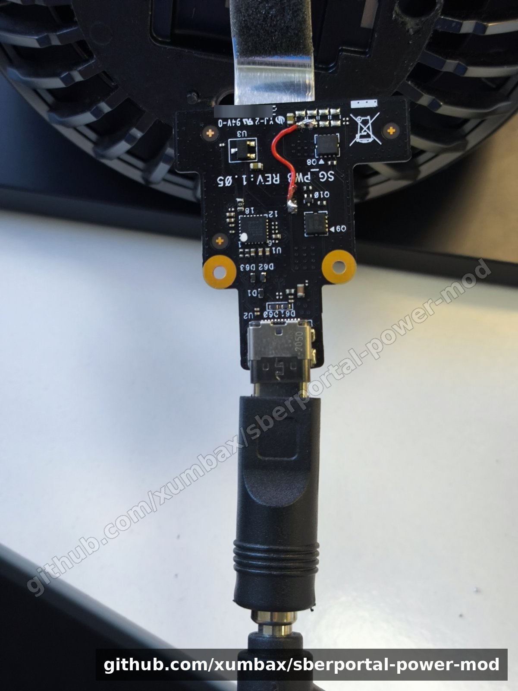
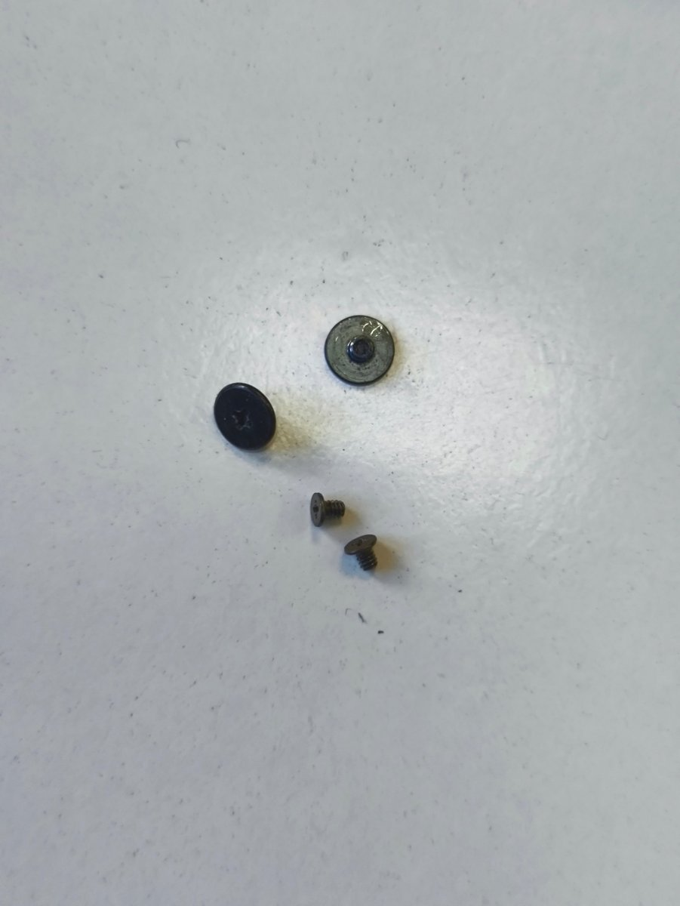
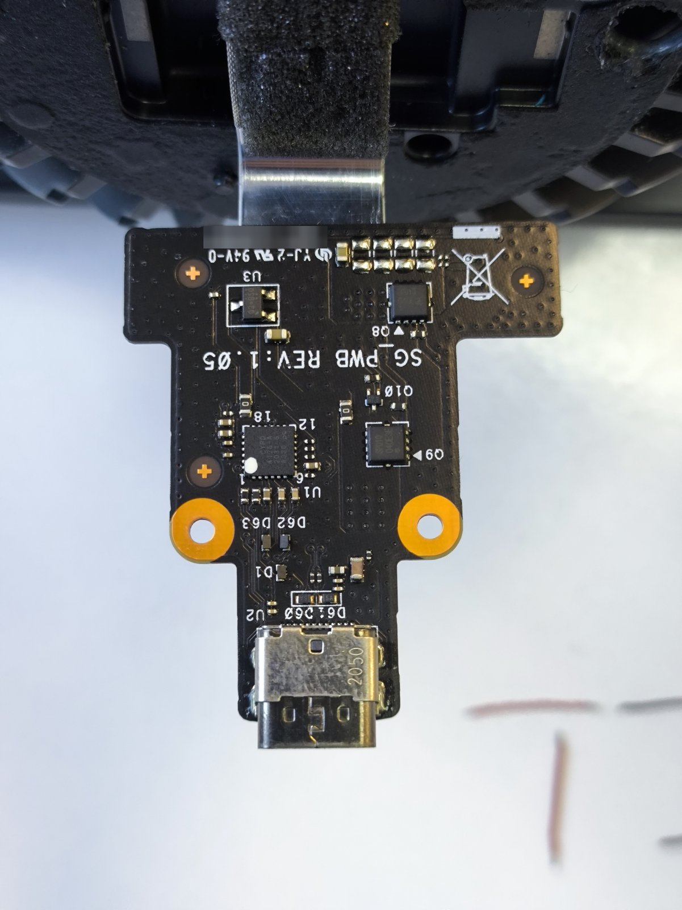
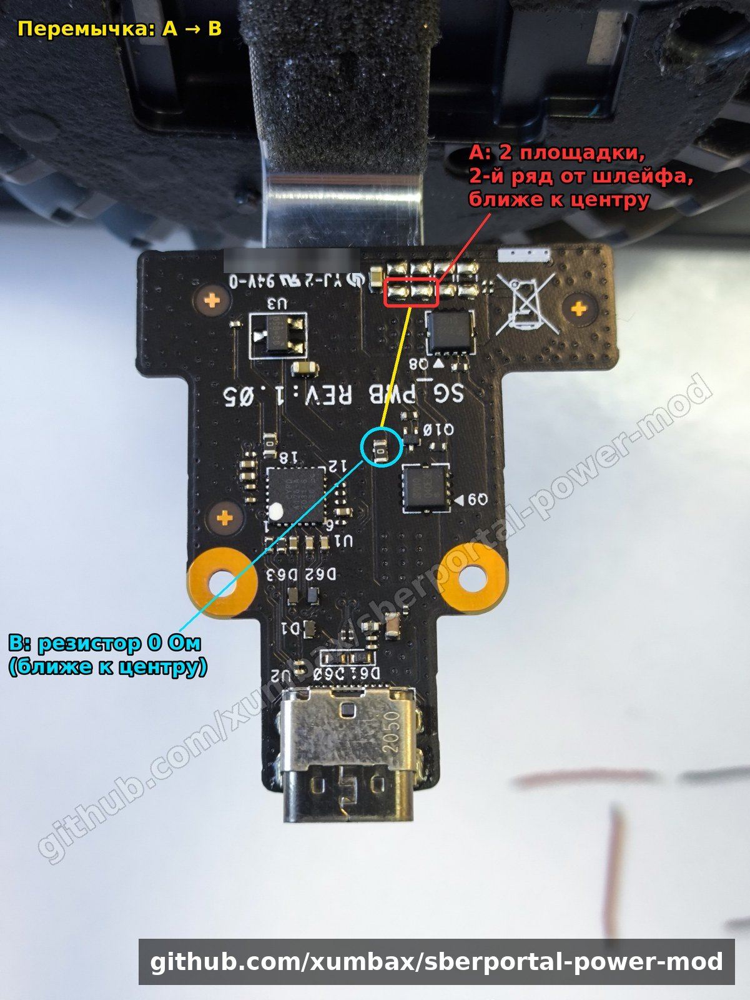
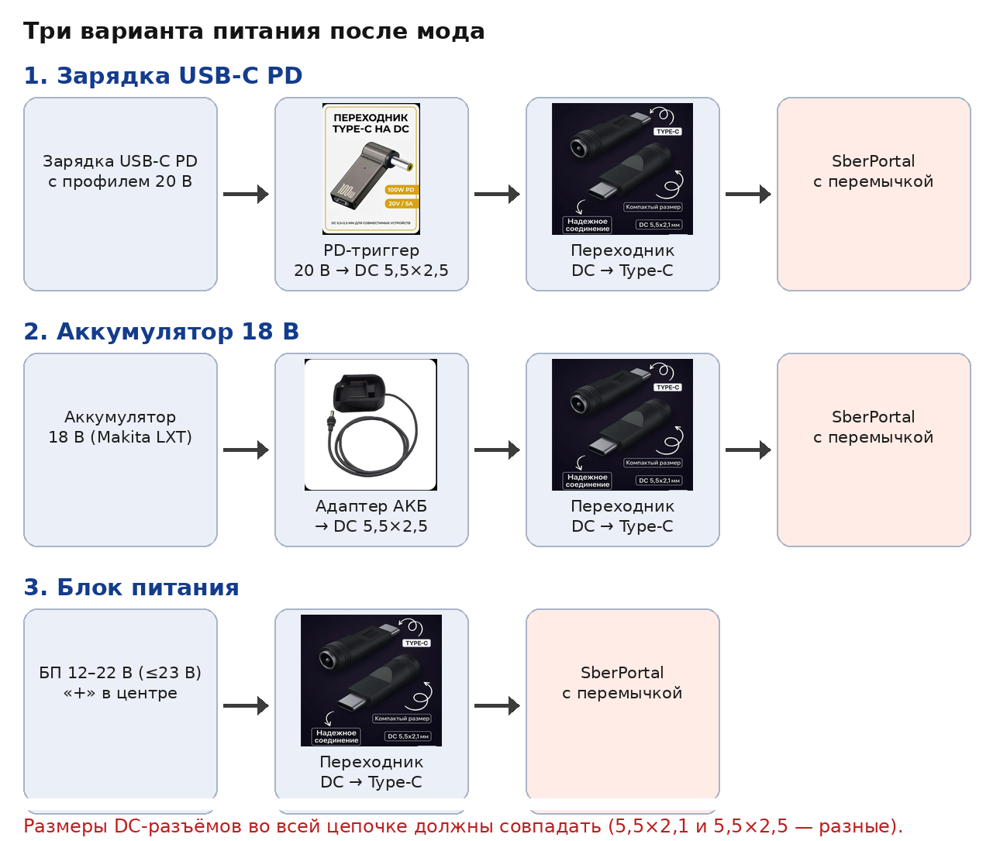
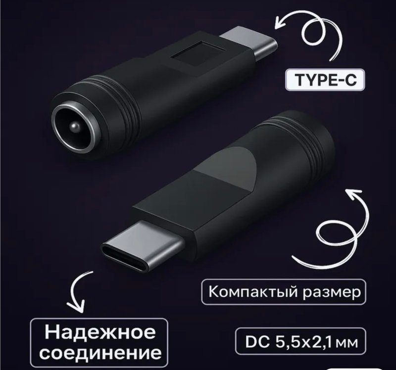
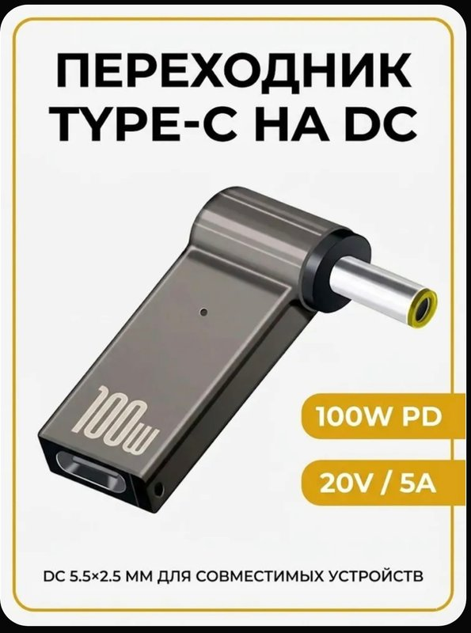
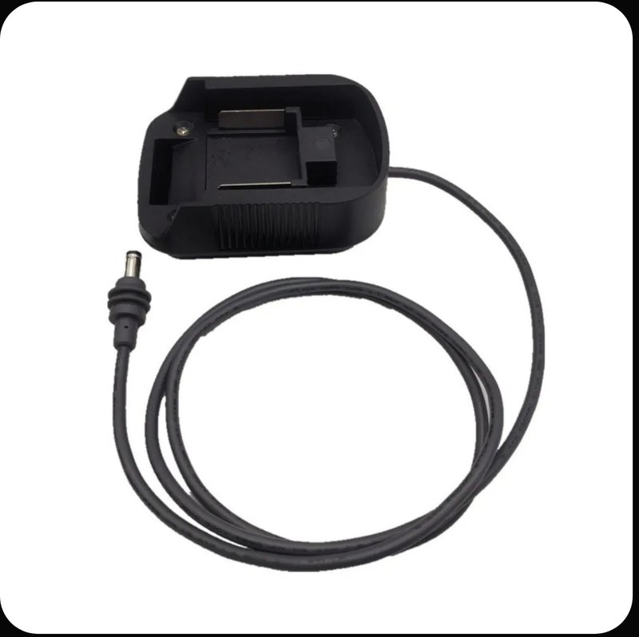

# SberPortal без родного блока питания: мод с одной перемычкой

Как запитать смарт-дисплей **SberPortal** от обычной зарядки USB-C PD, ноутбучного
блока питания или аккумулятора электроинструмента. Нужна одна перемычка на плате
питания внутри устройства.

> ⚠️ **Это аппаратная модификация, которая отключает штатную защиту входа.**
> Всё делаете на свой страх и риск. Прочитайте раздел [Риски](#-риски-прочитайте-до-пайки)
> до того, как возьмёте паяльник.

---

## Зачем это нужно

Родной блок питания SberPortal нестандартный. Как рассказал инженер SberDevices
[в статье на Хабре](https://habr.com/ru/companies/sberdevices/articles/571362/),
ради звука выбрали профиль USB Power Delivery **22 В**. Блок отдаёт только два профиля:
**5 В / 3 А и 22 В / 2,95 А**.

Портал запрашивает именно 22 В. Обычные PD-зарядки выдают максимум 20 В
(5/9/12/15/20 В), поэтому Портал получает 5 В и **не включается ни от какой
сторонней зарядки**, даже от ноутбучной на 100 Вт. Родной блок дорогой и бывает в
продаже не всегда.

### Как работает мод

На маленькой плате питания (маркировка **`SG_PWB REV:1.05`**) стоят PD-контроллер
(U1, Cypress EZ-PD) и силовые MOSFET-ключи (Q8, Q9). Ключи подают питание на основную
плату только после того, как с блоком согласованы 22 В.

Перемычка подаёт напряжение с разъёма на основную плату **в обход ключа**. После этого
Портал работает от любого постоянного напряжения в допустимом диапазоне, и
согласовывать его по PD больше не нужно.

Идею впервые опубликовали на 4PDA (ссылки в разделе [Источники и благодарности](#источники-и-благодарности)).
Здесь собраны пошаговая инструкция, фото и проверенные варианты питания.

---

## Какое напряжение подавать

| Напряжение | Что будет |
|---|---|
| ниже 12 В | может загрузиться, но под нагрузкой (громкий звук) возможны перезагрузки |
| **12–22 В** | **работает стабильно** (проверено) |
| 19–22 В | рекомендуемый диапазон: ближе к штатным 22 В, у усилителя больше запаса по громкости |
| **выше 23 В** | **нельзя**: защиты больше нет, можно сжечь основную плату |

Ток — не меньше 2 А, лучше 3 А. Реальное потребление скромное: около 5 Вт в ожидании
и около 10 Вт на большой громкости (замер [iXBT](https://www.ixbt.com/ds/sberportal-smart-display-review.html)).
Но короткие пики звука выше.

---

## 🔥 Риски (прочитайте до пайки)

- **Нет защиты от перенапряжения.** Раньше PD-контроллер пропускал только согласованные
  22 В. После мода всё, что придёт на разъём, сразу попадает на основную плату. Блок на
  24 В, неисправный БП или ошибка в переходниках могут убить устройство.
- **Нет защиты от переполюсовки.** Если блок с разъёмом DC подключён с «минусом в
  центре», напряжение придёт с обратной полярностью. Перед первым подключением
  **проверьте полярность мультиметром**: «плюс» должен быть в центре штекера.
- **Переходник DC → Type-C опасен для других устройств.** Он выдаёт на контакт VBUS
  «голые» 12–22 В без всякого согласования. Воткнёте его в телефон, ноутбук или наушники —
  можете их сжечь. **Пометьте этот переходник (например, красной изолентой) и не
  используйте ни с чем, кроме доработанного Портала.**
- **Броски при подключении.** Сначала вставьте штекер в Портал, потом включайте блок в
  розетку. Не подключайте «горячий» блок, который уже работает.
- **Аккумуляторы (вариант 2).** Дешёвые адаптеры для аккумуляторов электроинструмента
  часто не умеют отключать нагрузку при разряде. Портал будет тянуть аккумулятор до
  глубокого разряда, а это его портит. Выбирайте адаптер с защитой от переразряда
  (low voltage protection) или не оставляйте разряженный аккумулятор подключённым.
- **Гарантия и ремонт.** Вскрытие лишает гарантии. Сервис может отказать в ремонте.
- **Ревизии платы.** Описано для платы `SG_PWB REV:1.05`. Если у вас другая маркировка
  или другая разводка — не паяйте вслепую.
- **Родной блок питания** после мода, вероятно, продолжит работать (PD-контроллер остался
  на месте). Мы это не проверяли.

Автор не несёт ответственности за любой ущерб: испорченные устройства, аккумуляторы,
имущество или здоровье. Проект не связан со Сбером и SberDevices. Названия
используются только для обозначения устройства.

---

## Что понадобится

**Инструмент:** паяльник с тонким жалом, флюс, припой, отвёртка под винты корпуса,
пинцет, мультиметр, каптоновый скотч.

**Перемычка:** провод 22–24 AWG в силиконовой изоляции, длиной около 3 см.

**Для питания** — один из трёх наборов ниже, подробно в [BOM.md](BOM.md).

---

## Пошаговая инструкция

### 1. Вскрытие
1. Отключите Портал от питания.
2. Снизу снимите наклейку с резинкой. Под ней **открутите три винта** и снимите крышку.
3. Открутите **два винта** платы питания и аккуратно высвободите плату. Она остаётся
   на шлейфе, **не повредите шлейф**.

### 2. Найдите точки

- **Точка A:** группа из 8 свободных площадок (2 ряда по 4) у края платы со стороны
  шлейфа. Нужен **второй ряд** (дальний от шлейфа). Удобно подпаяться сразу к **двум
  площадкам, которые ближе к центру платы**.
- **Точка B:** **резистор 0 Ом, который ближе к центру платы** (на фото — слева от Q10).

### 3. Пайка
1. Нанесите флюс и залудите точку A (обе площадки одной каплей) и точку B.
2. Припаяйте провод одним концом к точке A, вторым — **поверх резистора 0 Ом или
   вместо него** (точка B).
3. Провод должен лежать без натяжения и не касаться других деталей. Зафиксируйте его
   каптоновым скотчем.
4. Отмойте флюс и проверьте, что нет перемычек и соплей припоя на соседних деталях.

### 4. Сборка
Соберите в обратном порядке: два винта платы, крышка, три винта, наклейка.

### 5. Первый запуск
1. Проверьте мультиметром выход вашего источника: напряжение в пределах 12–23 В,
   «плюс» в центре.
2. Подключите штекер к Порталу, затем включите источник.
3. Портал должен загрузиться. Прогоните громкую музыку 10–15 минут и убедитесь, что нет
   перезагрузок и ничего не греется.

---

## Чем питать после мода: три варианта

Во всех вариантах нужен «прямой» переходник **DC-гнездо → Type-C-штекер** (без PD-чипа):

> ⚠️ Этот переходник выдаёт «голое» напряжение на VBUS. Пометьте его и **никогда не
> втыкайте в телефон, ноутбук и другие устройства** — только в доработанный Портал.

### Вариант 1. Любая зарядка USB-C PD + триггер 20 В
**Зарядка → кабель C–C → PD-триггер 20 В (выход DC) → переходник DC → Type-C → Портал**

- Триггер «притворяется» ноутбуком и просит у зарядки 20 В.
- Зарядке нужен **профиль 20 В**. Обычно он есть у зарядок от 45 Вт («для ноутбука»,
  GaN 65 Вт). У многих телефонных зарядок на 20–25 Вт профиля 20 В нет: смотрите на
  наклейке строку `20V⎓…A`.
- Для слабых зарядок есть триггеры с выбором 12/15 В. Портал стабилен от 12 В, но
  запаса по громкости будет меньше.

### Вариант 2. Автономно от аккумулятора электроинструмента
**Аккумулятор 18 В (Makita LXT и аналоги) → адаптер с выходом DC 5,5×2,5 → переходник DC → Type-C → Портал**

- Напряжение 18-вольтовой линейки — примерно 20 В на заряженном и 14–15 В на разряженном.
  Это укладывается в рабочий диапазон.
- Ориентировочно: аккумулятора 5 А·ч (~90 Вт·ч) хватает на 7–10 часов работы (расчёт,
  не замер).
- Обязательно прочитайте про переразряд в разделе [Риски](#-риски-прочитайте-до-пайки).

### Вариант 3. Блок питания от ноутбука или другого устройства
**БП → переходник DC → Type-C → Портал**

- Чем ближе к **22 В / 3 А**, тем лучше, но **не больше 23 В**. Типичные ноутбучные
  19–20 В подходят отлично.
- Работать будет и при меньших напряжении и токе (от 12 В, от 2 А).
- Проверьте полярность («плюс» в центре) и размер штекера.

> ⚠️ **Размеры DC-разъёмов должны совпадать.** 5,5×2,1 и 5,5×2,5 — разные разъёмы.
> Штекер 5,5×2,5 в гнездо 5,5×2,1 войдёт, но контакт будет плохой и будет греться.
> Покупайте все части одного размера.

---

> Фото товаров — примеры с маркетплейсов, для наглядности. Конкретный продавец не важен,
> важны параметры: напряжение, ток, размер разъёма и отсутствие PD-чипа в переходнике DC → Type-C.

## Источники и благодарности

- **Первоисточник мода:** пользователь **dazed7645** на 4PDA — [фото](https://4pda.to/forum/index.php?showtopic=1039403&view=findpost&p=144653296),
  [инструкция](https://4pda.to/forum/index.php?showtopic=1039403&view=findpost&p=144678988).
  Ранее запуск от внешнего источника 19 В показал пользователь **о219р**
  ([пост](https://4pda.to/forum/index.php?showtopic=1039403&view=findpost&p=142352392)).
- **Ветка SberPortal на 4PDA:** https://4pda.to/forum/index.php?showtopic=1039403
- **Статья производителя** (SberDevices, Хабр) — про USB Power Delivery и профиль 22 В в SberPortal:
  https://habr.com/ru/companies/sberdevices/articles/571362/
- **Обзор iXBT** (потребление): https://www.ixbt.com/ds/sberportal-smart-display-review.html

Если повторили мод — откройте Issue с маркировкой вашей платы, напряжением и результатом.
Это поможет следующим.

## Лицензия

Текст и фото — [CC BY-SA 4.0](LICENSE.md).
